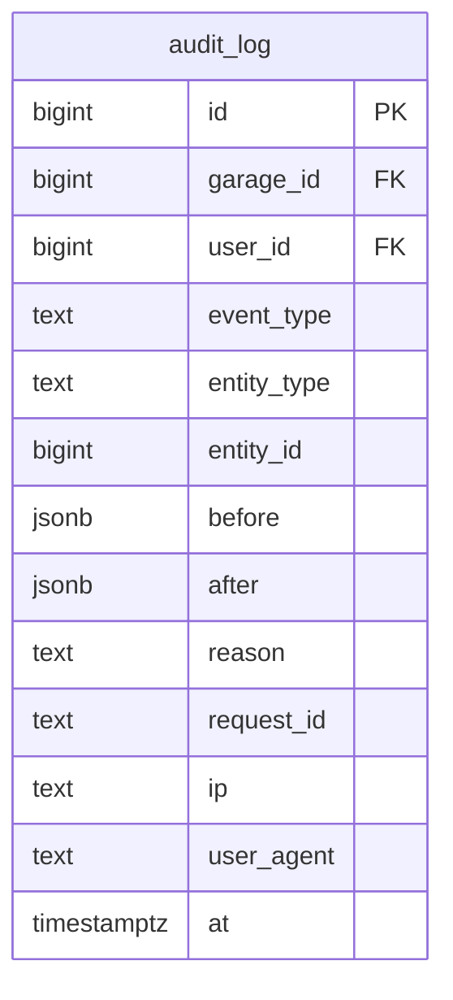

# ERD — Audit Log

```mermaid
erDiagram
    audit_log {
        bigint id PK
        bigint garage_id FK
        bigint user_id FK
        text event_type
        text entity_type
        bigint entity_id
        jsonb before
        jsonb after
        text reason
        text request_id
        text ip
        text user_agent
        timestamptz at
    }
```

`audit_log` is append-only. Retention is per `CFG_RETENTION_AUDIT_YEARS` (default 10).
