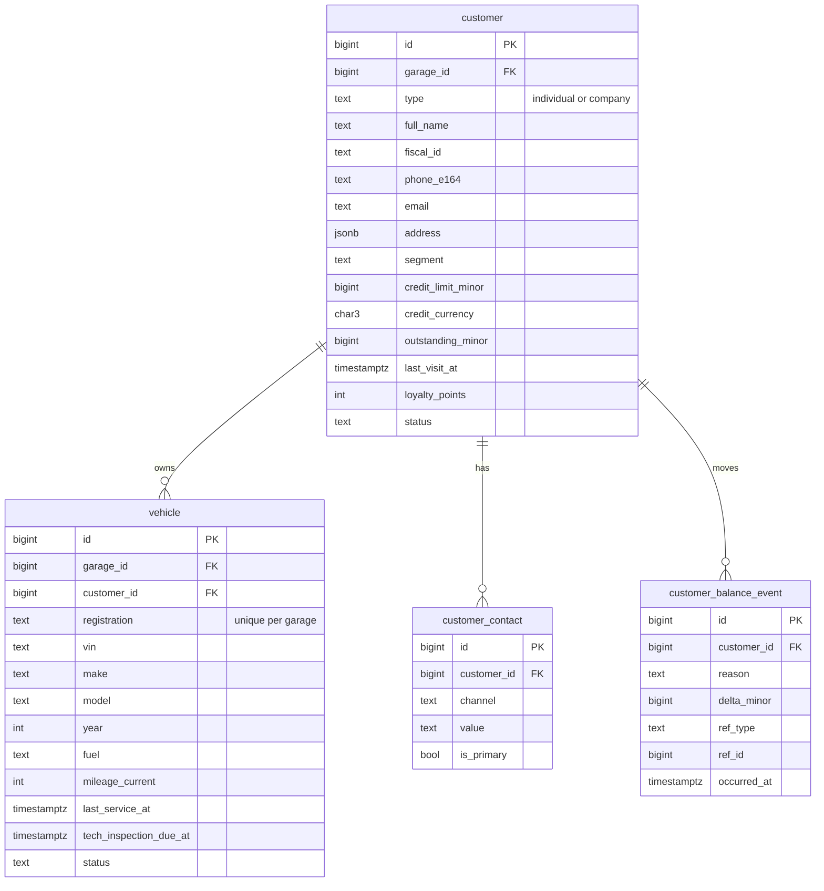

# ERD — Customer and Vehicle

```mermaid
erDiagram
    customer ||--o{ vehicle : owns
    customer ||--o{ customer_contact : has
    customer ||--o{ customer_balance_event : moves
    customer {
        bigint id PK
        bigint garage_id FK
        text type "individual or company"
        text full_name
        text fiscal_id
        text phone_e164
        text email
        jsonb address
        text segment
        bigint credit_limit_minor
        char3 credit_currency
        bigint outstanding_minor
        timestamptz last_visit_at
        int loyalty_points
        text status
    }
    vehicle {
        bigint id PK
        bigint garage_id FK
        bigint customer_id FK
        text registration "unique per garage"
        text vin
        text make
        text model
        int year
        text fuel
        int mileage_current
        timestamptz last_service_at
        timestamptz tech_inspection_due_at
        text status
    }
    customer_contact {
        bigint id PK
        bigint customer_id FK
        text channel
        text value
        bool is_primary
    }
    customer_balance_event {
        bigint id PK
        bigint customer_id FK
        text reason
        bigint delta_minor
        text ref_type
        bigint ref_id
        timestamptz occurred_at
    }
```
