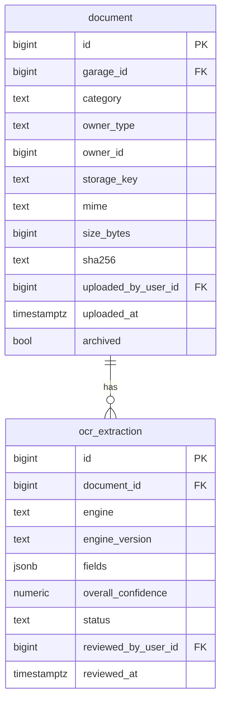

# ERD — Documents and OCR Extractions

```mermaid
erDiagram
    document ||--o{ ocr_extraction : has
    document {
        bigint id PK
        bigint garage_id FK
        text category
        text owner_type
        bigint owner_id
        text storage_key
        text mime
        bigint size_bytes
        text sha256
        bigint uploaded_by_user_id FK
        timestamptz uploaded_at
        bool archived
    }
    ocr_extraction {
        bigint id PK
        bigint document_id FK
        text engine
        text engine_version
        jsonb fields
        numeric overall_confidence
        text status
        bigint reviewed_by_user_id FK
        timestamptz reviewed_at
    }
```
