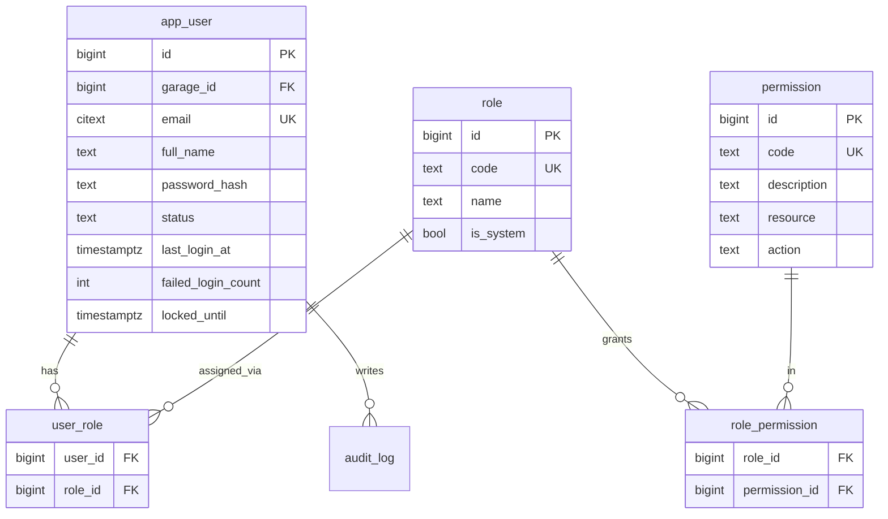

# ERD — Identity and RBAC

```mermaid
erDiagram
    app_user ||--o{ user_role : has
    role ||--o{ user_role : assigned_via
    role ||--o{ role_permission : grants
    permission ||--o{ role_permission : in
    app_user ||--o{ audit_log : writes

    app_user {
        bigint id PK
        bigint garage_id FK
        citext email UK
        text full_name
        text password_hash
        text status
        timestamptz last_login_at
        int failed_login_count
        timestamptz locked_until
    }
    role {
        bigint id PK
        text code UK
        text name
        bool is_system
    }
    permission {
        bigint id PK
        text code UK
        text description
        text resource
        text action
    }
    user_role {
        bigint user_id FK
        bigint role_id FK
    }
    role_permission {
        bigint role_id FK
        bigint permission_id FK
    }
```
