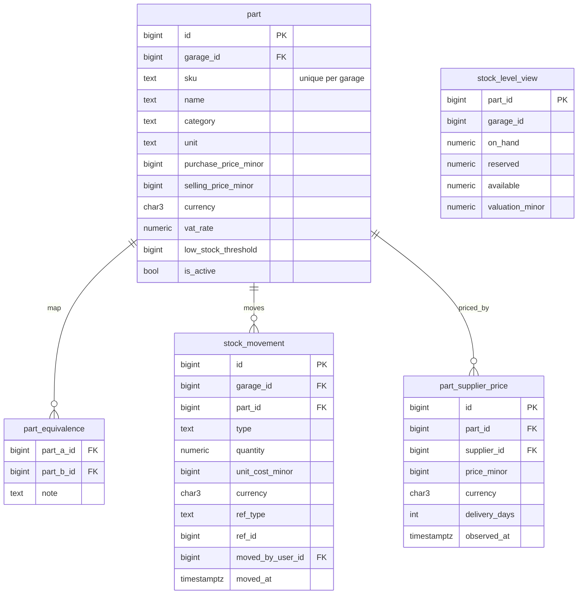

# ERD — Inventory and Stock

```mermaid
erDiagram
    part ||--o{ part_equivalence : map
    part ||--o{ stock_movement : moves
    part ||--o{ part_supplier_price : priced_by

    part {
        bigint id PK
        bigint garage_id FK
        text sku "unique per garage"
        text name
        text category
        text unit
        bigint purchase_price_minor
        bigint selling_price_minor
        char3 currency
        numeric vat_rate
        bigint low_stock_threshold
        bool is_active
    }
    part_equivalence {
        bigint part_a_id FK
        bigint part_b_id FK
        text note
    }
    stock_movement {
        bigint id PK
        bigint garage_id FK
        bigint part_id FK
        text type
        numeric quantity
        bigint unit_cost_minor
        char3 currency
        text ref_type
        bigint ref_id
        bigint moved_by_user_id FK
        timestamptz moved_at
    }
    stock_level_view {
        bigint part_id PK
        bigint garage_id
        numeric on_hand
        numeric reserved
        numeric available
        numeric valuation_minor
    }
    part_supplier_price {
        bigint id PK
        bigint part_id FK
        bigint supplier_id FK
        bigint price_minor
        char3 currency
        int delivery_days
        timestamptz observed_at
    }
```
