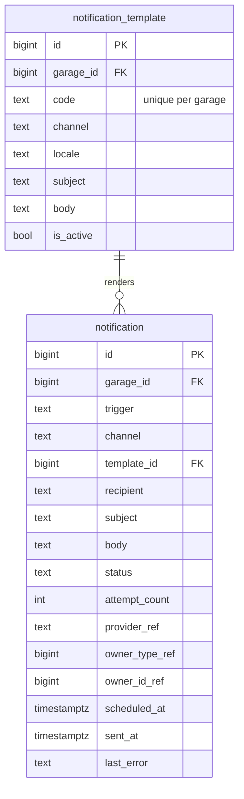

# ERD — Notifications and Templates

```mermaid
erDiagram
    notification_template ||--o{ notification : renders
    notification {
        bigint id PK
        bigint garage_id FK
        text trigger
        text channel
        bigint template_id FK
        text recipient
        text subject
        text body
        text status
        int attempt_count
        text provider_ref
        bigint owner_type_ref
        bigint owner_id_ref
        timestamptz scheduled_at
        timestamptz sent_at
        text last_error
    }
    notification_template {
        bigint id PK
        bigint garage_id FK
        text code "unique per garage"
        text channel
        text locale
        text subject
        text body
        bool is_active
    }
```
