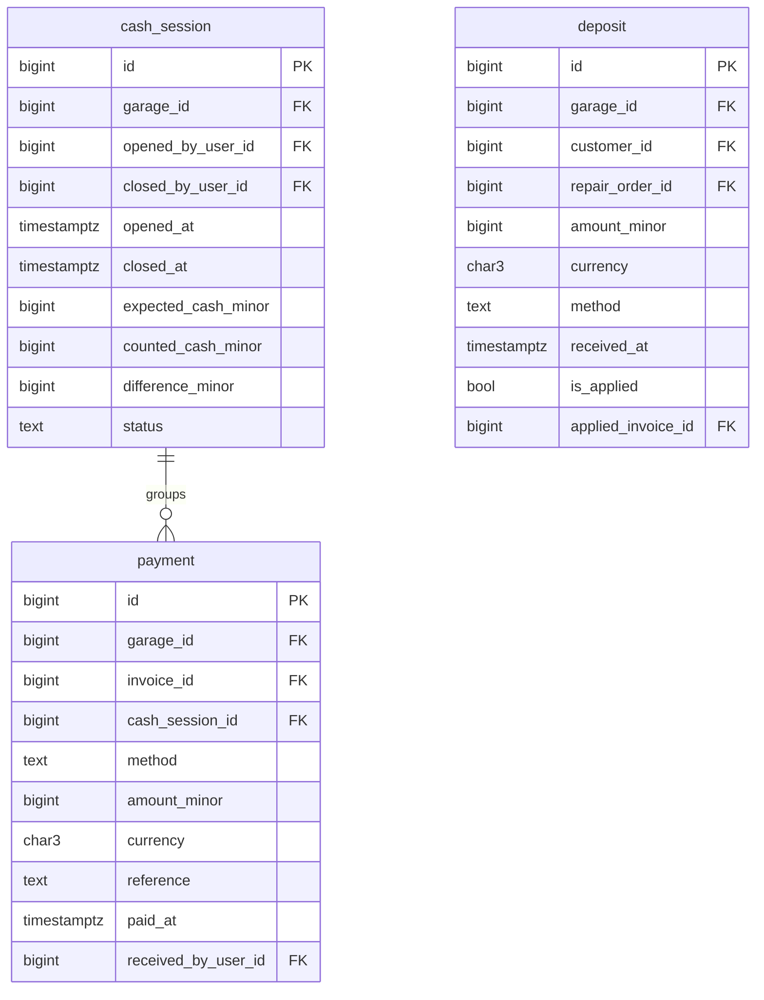

# ERD — Payments, Deposits, Cash Sessions

```mermaid
erDiagram
    cash_session ||--o{ payment : groups
    cash_session {
        bigint id PK
        bigint garage_id FK
        bigint opened_by_user_id FK
        bigint closed_by_user_id FK
        timestamptz opened_at
        timestamptz closed_at
        bigint expected_cash_minor
        bigint counted_cash_minor
        bigint difference_minor
        text status
    }
    payment {
        bigint id PK
        bigint garage_id FK
        bigint invoice_id FK
        bigint cash_session_id FK
        text method
        bigint amount_minor
        char3 currency
        text reference
        timestamptz paid_at
        bigint received_by_user_id FK
    }
    deposit {
        bigint id PK
        bigint garage_id FK
        bigint customer_id FK
        bigint repair_order_id FK
        bigint amount_minor
        char3 currency
        text method
        timestamptz received_at
        bool is_applied
        bigint applied_invoice_id FK
    }
```
