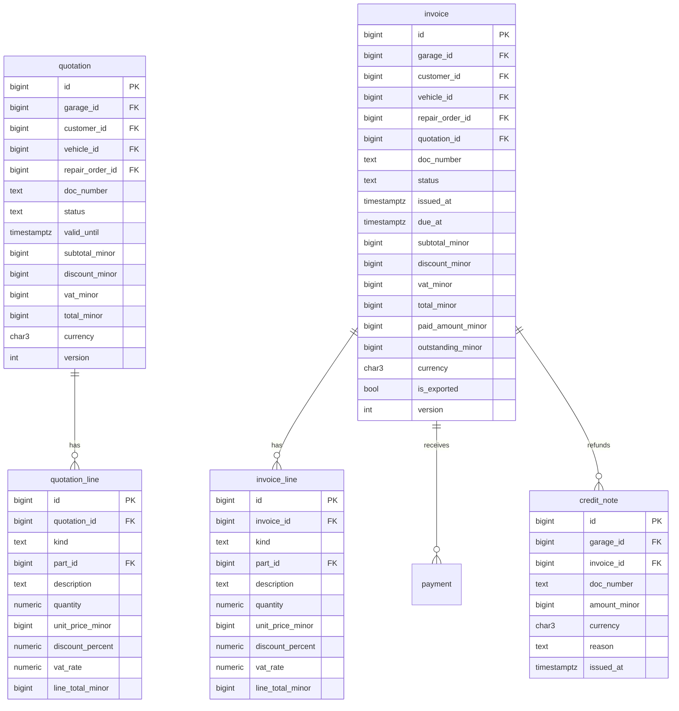

# ERD — Quotation, Invoice, Credit Note

```mermaid
erDiagram
    quotation ||--o{ quotation_line : has
    quotation {
        bigint id PK
        bigint garage_id FK
        bigint customer_id FK
        bigint vehicle_id FK
        bigint repair_order_id FK
        text doc_number
        text status
        timestamptz valid_until
        bigint subtotal_minor
        bigint discount_minor
        bigint vat_minor
        bigint total_minor
        char3 currency
        int version
    }
    quotation_line {
        bigint id PK
        bigint quotation_id FK
        text kind
        bigint part_id FK
        text description
        numeric quantity
        bigint unit_price_minor
        numeric discount_percent
        numeric vat_rate
        bigint line_total_minor
    }
    invoice ||--o{ invoice_line : has
    invoice ||--o{ payment : receives
    invoice ||--o{ credit_note : refunds
    invoice {
        bigint id PK
        bigint garage_id FK
        bigint customer_id FK
        bigint vehicle_id FK
        bigint repair_order_id FK
        bigint quotation_id FK
        text doc_number
        text status
        timestamptz issued_at
        timestamptz due_at
        bigint subtotal_minor
        bigint discount_minor
        bigint vat_minor
        bigint total_minor
        bigint paid_amount_minor
        bigint outstanding_minor
        char3 currency
        bool is_exported
        int version
    }
    invoice_line {
        bigint id PK
        bigint invoice_id FK
        text kind
        bigint part_id FK
        text description
        numeric quantity
        bigint unit_price_minor
        numeric discount_percent
        numeric vat_rate
        bigint line_total_minor
    }
    credit_note {
        bigint id PK
        bigint garage_id FK
        bigint invoice_id FK
        text doc_number
        bigint amount_minor
        char3 currency
        text reason
        timestamptz issued_at
    }
```
