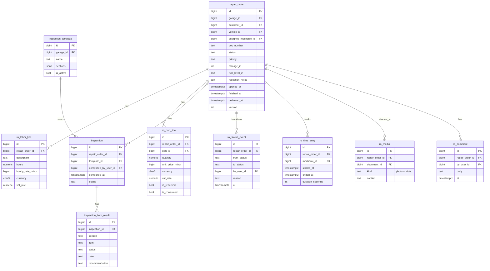

# ERD — Repair Order and Inspection

```mermaid
erDiagram
    repair_order ||--o{ ro_labor_line : has
    repair_order ||--o{ ro_part_line : has
    repair_order ||--o{ inspection : has
    repair_order ||--o{ ro_status_event : transitions
    repair_order ||--o{ ro_time_entry : tracks
    repair_order ||--o{ ro_media : attached_to
    repair_order ||--o{ ro_comment : has

    repair_order {
        bigint id PK
        bigint garage_id FK
        bigint customer_id FK
        bigint vehicle_id FK
        bigint assigned_mechanic_id FK
        text doc_number
        text status
        text priority
        int mileage_in
        text fuel_level_in
        text reception_notes
        timestamptz opened_at
        timestamptz finished_at
        timestamptz delivered_at
        int version
    }
    ro_labor_line {
        bigint id PK
        bigint repair_order_id FK
        text description
        numeric hours
        bigint hourly_rate_minor
        char3 currency
        numeric vat_rate
    }
    ro_part_line {
        bigint id PK
        bigint repair_order_id FK
        bigint part_id FK
        numeric quantity
        bigint unit_price_minor
        char3 currency
        numeric vat_rate
        bool is_reserved
        bool is_consumed
    }
    inspection ||--o{ inspection_item_result : has
    inspection_template ||--o{ inspection : seeds
    inspection {
        bigint id PK
        bigint repair_order_id FK
        bigint template_id FK
        bigint completed_by_user_id FK
        timestamptz completed_at
        text status
    }
    inspection_template {
        bigint id PK
        bigint garage_id FK
        text name
        jsonb sections
        bool is_active
    }
    inspection_item_result {
        bigint id PK
        bigint inspection_id FK
        text section
        text item
        text status
        text note
        text recommendation
    }
    ro_status_event {
        bigint id PK
        bigint repair_order_id FK
        text from_status
        text to_status
        bigint by_user_id FK
        text reason
        timestamptz at
    }
    ro_time_entry {
        bigint id PK
        bigint repair_order_id FK
        bigint mechanic_id FK
        timestamptz started_at
        timestamptz ended_at
        int duration_seconds
    }
    ro_media {
        bigint id PK
        bigint repair_order_id FK
        bigint document_id FK
        text kind "photo or video"
        text caption
    }
    ro_comment {
        bigint id PK
        bigint repair_order_id FK
        bigint by_user_id FK
        text body
        timestamptz at
    }
```
