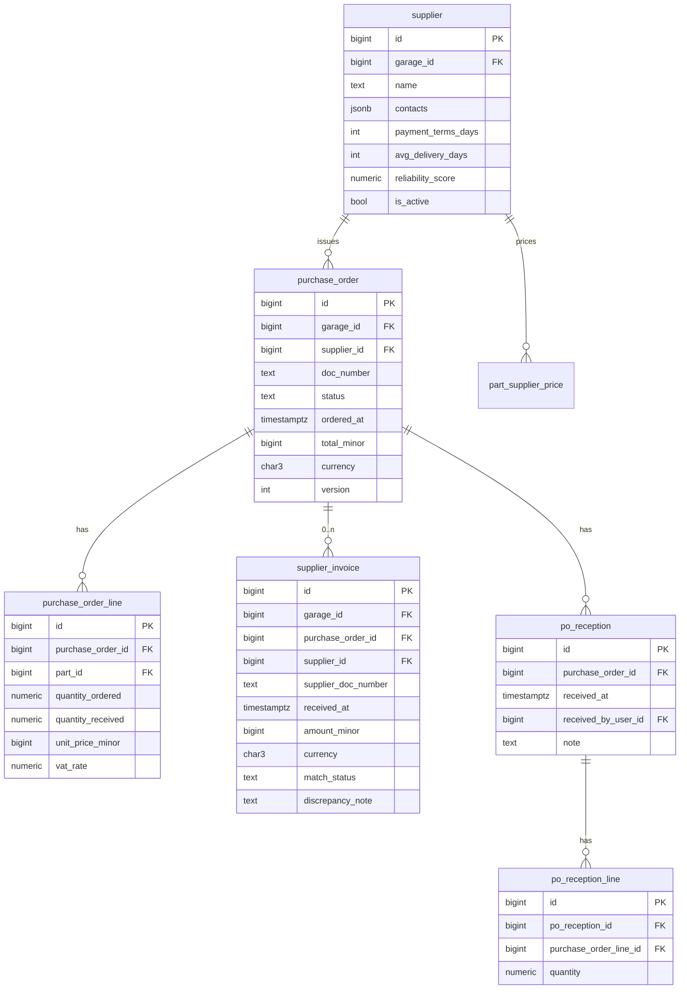

# ERD — Supplier and Purchasing

```mermaid
erDiagram
    supplier ||--o{ purchase_order : issues
    supplier ||--o{ part_supplier_price : prices

    supplier {
        bigint id PK
        bigint garage_id FK
        text name
        jsonb contacts
        int payment_terms_days
        int avg_delivery_days
        numeric reliability_score
        bool is_active
    }
    purchase_order ||--o{ purchase_order_line : has
    purchase_order ||--o{ supplier_invoice : "0..n"
    purchase_order ||--o{ po_reception : has
    purchase_order {
        bigint id PK
        bigint garage_id FK
        bigint supplier_id FK
        text doc_number
        text status
        timestamptz ordered_at
        bigint total_minor
        char3 currency
        int version
    }
    purchase_order_line {
        bigint id PK
        bigint purchase_order_id FK
        bigint part_id FK
        numeric quantity_ordered
        numeric quantity_received
        bigint unit_price_minor
        numeric vat_rate
    }
    po_reception ||--o{ po_reception_line : has
    po_reception {
        bigint id PK
        bigint purchase_order_id FK
        timestamptz received_at
        bigint received_by_user_id FK
        text note
    }
    po_reception_line {
        bigint id PK
        bigint po_reception_id FK
        bigint purchase_order_line_id FK
        numeric quantity
    }
    supplier_invoice {
        bigint id PK
        bigint garage_id FK
        bigint purchase_order_id FK
        bigint supplier_id FK
        text supplier_doc_number
        timestamptz received_at
        bigint amount_minor
        char3 currency
        text match_status
        text discrepancy_note
    }
```
