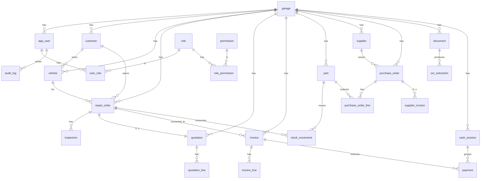

# ERD — Top Level

```mermaid
erDiagram
    garage ||--o{ app_user : has
    garage ||--o{ customer : has
    garage ||--o{ vehicle : has
    garage ||--o{ repair_order : has
    garage ||--o{ quotation : has
    garage ||--o{ invoice : has
    garage ||--o{ part : has
    garage ||--o{ supplier : has
    garage ||--o{ purchase_order : has
    garage ||--o{ document : has
    garage ||--o{ cash_session : has

    app_user ||--o{ user_role : has
    role ||--o{ user_role : in
    role ||--o{ role_permission : has
    permission ||--o{ role_permission : in

    customer ||--o{ vehicle : owns
    customer ||--o{ repair_order : opens
    vehicle ||--o{ repair_order : for

    repair_order ||--o{ inspection : has
    repair_order ||--|| quotation : "0..1"
    repair_order ||--o{ invoice : converted_to
    repair_order ||--o{ stock_movement : consumes

    quotation ||--o{ quotation_line : has
    invoice ||--o{ invoice_line : has
    invoice ||--o{ payment : receives

    part ||--o{ stock_movement : moves
    part ||--o{ purchase_order_line : ordered
    supplier ||--o{ purchase_order : issues
    purchase_order ||--o{ purchase_order_line : has
    purchase_order ||--o{ supplier_invoice : "0..n"

    cash_session ||--o{ payment : groups

    document ||--o{ ocr_extraction : produces

    app_user ||--o{ audit_log : writes
```

See [04_DATABASE_DESIGN.md](../../04_DATABASE_DESIGN.md) for the per-table column definitions.
