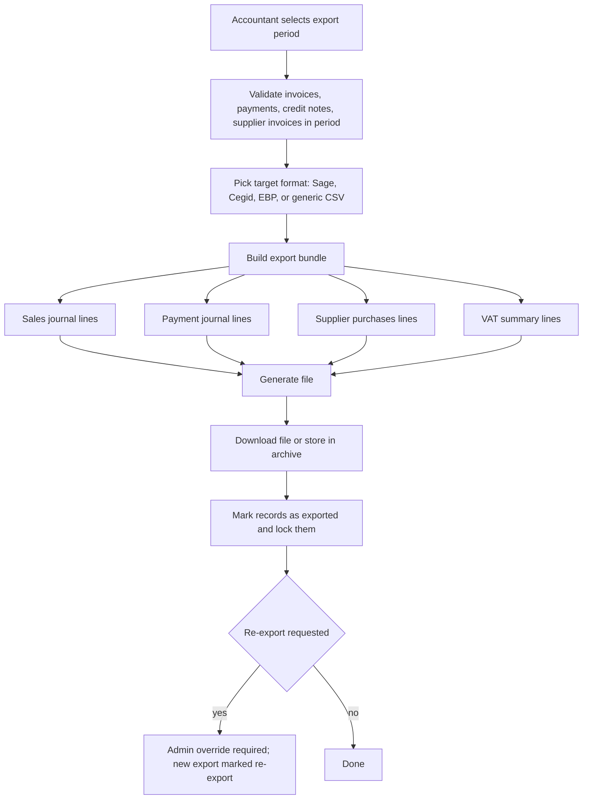

# Workflow — Accounting Export

```mermaid
flowchart TD
    A[Accountant selects export period] --> B[Validate invoices, payments, credit notes, supplier invoices in period]
    B --> C[Pick target format: Sage, Cegid, EBP, or generic CSV]
    C --> D[Build export bundle]
    D --> E[Sales journal lines]
    D --> F[Payment journal lines]
    D --> G[Supplier purchases lines]
    D --> H[VAT summary lines]
    E --> I[Generate file]
    F --> I
    G --> I
    H --> I
    I --> J[Download file or store in archive]
    J --> K[Mark records as exported and lock them]
    K --> L{Re-export requested}
    L -- yes --> M[Admin override required; new export marked re-export]
    L -- no --> N[Done]
```
