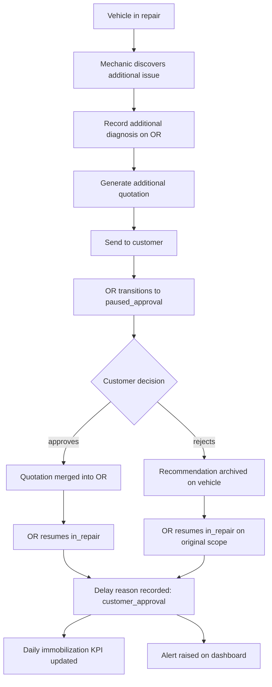

# Workflow — Additional Repair Discovery

Mid-repair, the mechanic finds extra work that was not in the original scope.

```mermaid
flowchart TD
    A[Vehicle in repair] --> B[Mechanic discovers additional issue]
    B --> C[Record additional diagnosis on OR]
    C --> D[Generate additional quotation]
    D --> E[Send to customer]
    E --> F[OR transitions to paused_approval]
    F --> G{Customer decision}
    G -- approves --> H[Quotation merged into OR]
    H --> I[OR resumes in_repair]
    G -- rejects --> J[Recommendation archived on vehicle]
    J --> K[OR resumes in_repair on original scope]
    I --> L[Delay reason recorded: customer_approval]
    K --> L
    L --> M[Daily immobilization KPI updated]
    L --> N[Alert raised on dashboard]
```
