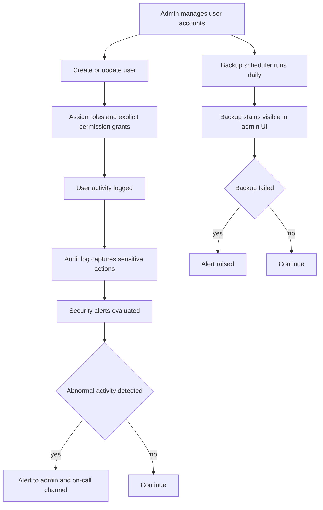

# Workflow — Admin and Security

```mermaid
flowchart TD
    A[Admin manages user accounts] --> B[Create or update user]
    B --> C[Assign roles and explicit permission grants]
    C --> D[User activity logged]
    D --> E[Audit log captures sensitive actions]
    E --> F[Security alerts evaluated]
    F --> G{Abnormal activity detected}
    G -- yes --> H[Alert to admin and on-call channel]
    G -- no --> I[Continue]
    A --> J[Backup scheduler runs daily]
    J --> K[Backup status visible in admin UI]
    K --> L{Backup failed}
    L -- yes --> M[Alert raised]
    L -- no --> N[Continue]
```
