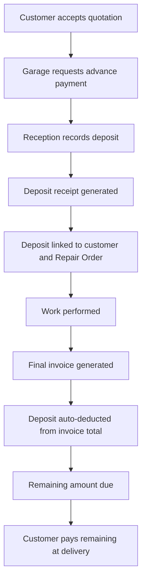

# Workflow — Advance Payment / Deposit

```mermaid
flowchart TD
    A[Customer accepts quotation] --> B[Garage requests advance payment]
    B --> C[Reception records deposit]
    C --> D[Deposit receipt generated]
    D --> E[Deposit linked to customer and Repair Order]
    E --> F[Work performed]
    F --> G[Final invoice generated]
    G --> H[Deposit auto-deducted from invoice total]
    H --> I[Remaining amount due]
    I --> J[Customer pays remaining at delivery]
```
