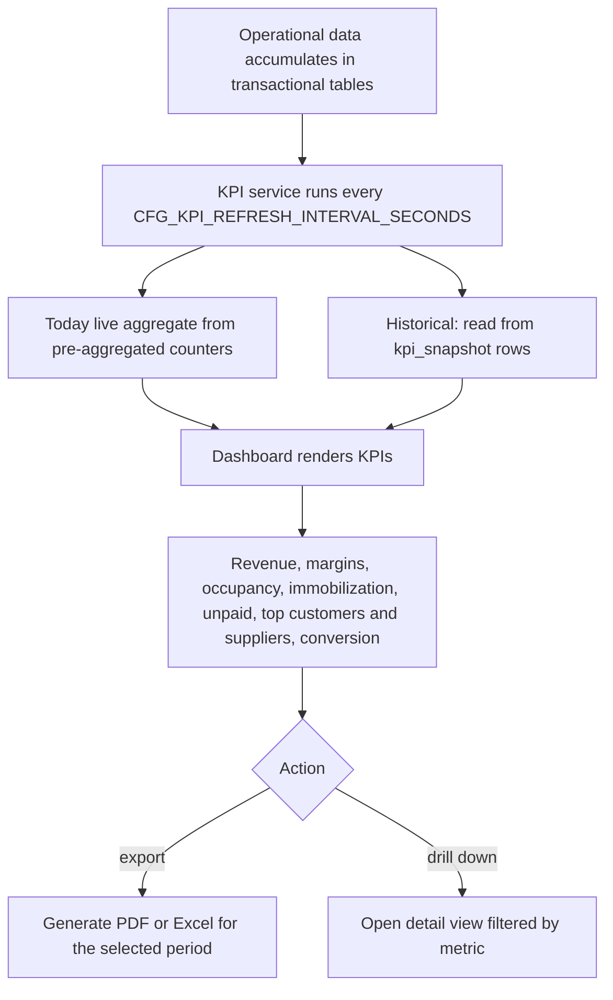

# Workflow — Analytics and Reporting

```mermaid
flowchart TD
    A[Operational data accumulates in transactional tables] --> B[KPI service runs every CFG_KPI_REFRESH_INTERVAL_SECONDS]
    B --> C[Today live aggregate from pre-aggregated counters]
    B --> D[Historical: read from kpi_snapshot rows]
    C --> E[Dashboard renders KPIs]
    D --> E
    E --> F[Revenue, margins, occupancy, immobilization, unpaid, top customers and suppliers, conversion]
    F --> G{Action}
    G -- export --> H[Generate PDF or Excel for the selected period]
    G -- drill down --> I[Open detail view filtered by metric]
```
