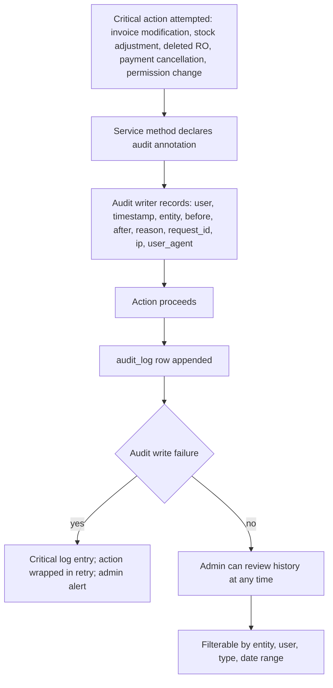

# Workflow — Audit and Traceability

```mermaid
flowchart TD
    A[Critical action attempted: invoice modification, stock adjustment, deleted RO, payment cancellation, permission change] --> B[Service method declares audit annotation]
    B --> C[Audit writer records: user, timestamp, entity, before, after, reason, request_id, ip, user_agent]
    C --> D[Action proceeds]
    D --> E[audit_log row appended]
    E --> F{Audit write failure}
    F -- yes --> G[Critical log entry; action wrapped in retry; admin alert]
    F -- no --> H[Admin can review history at any time]
    H --> I[Filterable by entity, user, type, date range]
```
