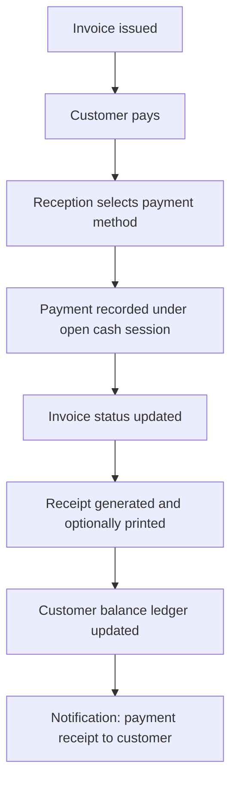

# Workflow — Cash Register

```mermaid
flowchart TD
    A[Invoice issued] --> B[Customer pays]
    B --> C[Reception selects payment method]
    C --> D[Payment recorded under open cash session]
    D --> E[Invoice status updated]
    E --> F[Receipt generated and optionally printed]
    F --> G[Customer balance ledger updated]
    G --> H[Notification: payment receipt to customer]
```
