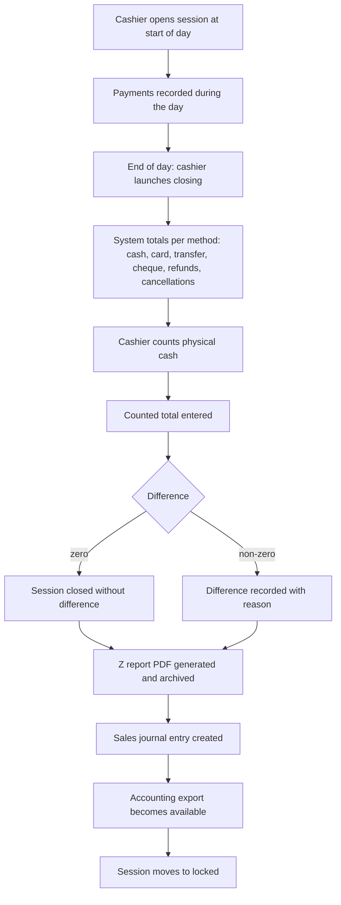

# Workflow — Cash Register Closing

```mermaid
flowchart TD
    A[Cashier opens session at start of day] --> B[Payments recorded during the day]
    B --> C[End of day: cashier launches closing]
    C --> D[System totals per method: cash, card, transfer, cheque, refunds, cancellations]
    D --> E[Cashier counts physical cash]
    E --> F[Counted total entered]
    F --> G{Difference}
    G -- zero --> H[Session closed without difference]
    G -- non-zero --> I[Difference recorded with reason]
    H --> J[Z report PDF generated and archived]
    I --> J
    J --> K[Sales journal entry created]
    K --> L[Accounting export becomes available]
    L --> M[Session moves to locked]
```
