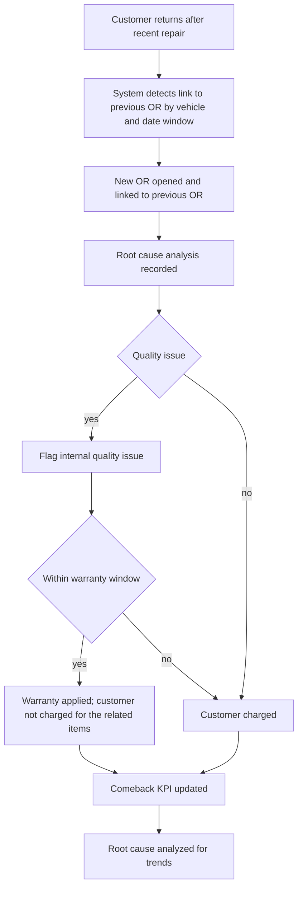

# Workflow — Comeback and Repair Failure

A customer returns after a recent repair.

```mermaid
flowchart TD
    A[Customer returns after recent repair] --> B[System detects link to previous OR by vehicle and date window]
    B --> C[New OR opened and linked to previous OR]
    C --> D[Root cause analysis recorded]
    D --> E{Quality issue}
    E -- yes --> F[Flag internal quality issue]
    F --> G{Within warranty window}
    G -- yes --> H[Warranty applied; customer not charged for the related items]
    G -- no --> I[Customer charged]
    E -- no --> I
    H --> J[Comeback KPI updated]
    I --> J
    J --> K[Root cause analyzed for trends]
```
