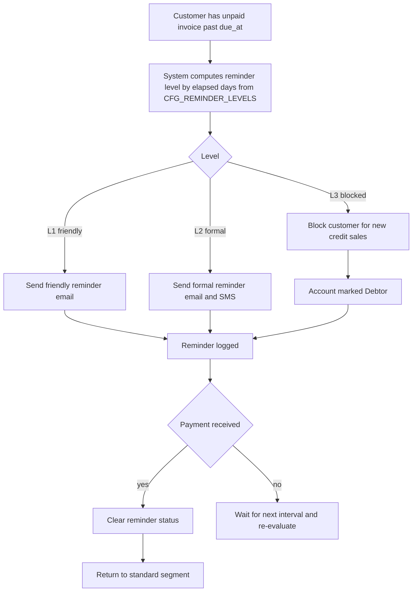

# Workflow — Customer Account Follow-Up (Reminder Ladder)

```mermaid
flowchart TD
    A[Customer has unpaid invoice past due_at] --> B[System computes reminder level by elapsed days from CFG_REMINDER_LEVELS]
    B --> C{Level}
    C -- L1 friendly --> D[Send friendly reminder email]
    C -- L2 formal --> E[Send formal reminder email and SMS]
    C -- L3 blocked --> F[Block customer for new credit sales]
    D --> G[Reminder logged]
    E --> G
    F --> H[Account marked Debtor]
    H --> G
    G --> I{Payment received}
    I -- yes --> J[Clear reminder status]
    I -- no --> K[Wait for next interval and re-evaluate]
    J --> L[Return to standard segment]
```
