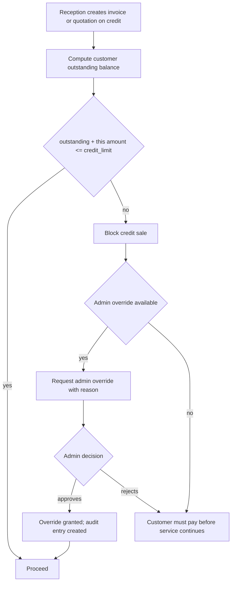

# Workflow — Customer Credit Limit Check

```mermaid
flowchart TD
    A[Reception creates invoice or quotation on credit] --> B[Compute customer outstanding balance]
    B --> C{outstanding + this amount <= credit_limit}
    C -- yes --> D[Proceed]
    C -- no --> E[Block credit sale]
    E --> F{Admin override available}
    F -- yes --> G[Request admin override with reason]
    G --> H{Admin decision}
    H -- approves --> I[Override granted; audit entry created]
    H -- rejects --> J[Customer must pay before service continues]
    F -- no --> J
    I --> D
```

Per the brief: only Admin can modify the credit_limit threshold itself. `customer.credit_limit.update` permission.
