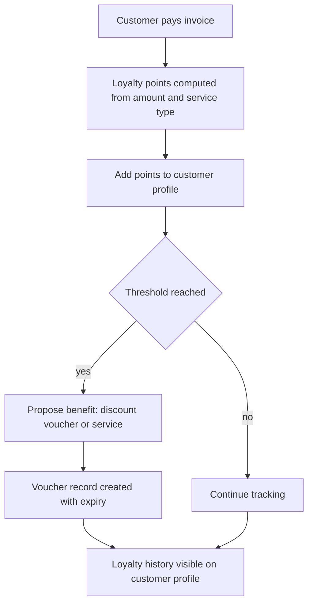

# Workflow — Customer Loyalty

```mermaid
flowchart TD
    A[Customer pays invoice] --> B[Loyalty points computed from amount and service type]
    B --> C[Add points to customer profile]
    C --> D{Threshold reached}
    D -- yes --> E[Propose benefit: discount voucher or service]
    D -- no --> F[Continue tracking]
    E --> G[Voucher record created with expiry]
    G --> H[Loyalty history visible on customer profile]
    F --> H
```
