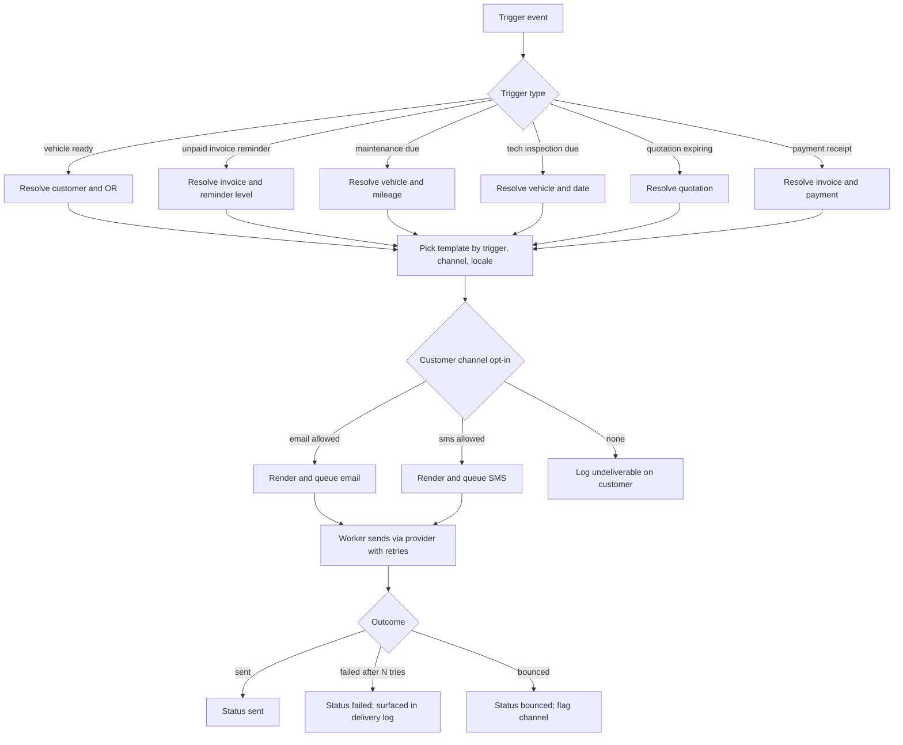

# Workflow — Customer Notification

```mermaid
flowchart TD
    A[Trigger event] --> B{Trigger type}
    B -- vehicle ready --> C[Resolve customer and OR]
    B -- unpaid invoice reminder --> D[Resolve invoice and reminder level]
    B -- maintenance due --> E[Resolve vehicle and mileage]
    B -- tech inspection due --> F[Resolve vehicle and date]
    B -- quotation expiring --> G[Resolve quotation]
    B -- payment receipt --> H[Resolve invoice and payment]
    C --> I[Pick template by trigger, channel, locale]
    D --> I
    E --> I
    F --> I
    G --> I
    H --> I
    I --> J{Customer channel opt-in}
    J -- email allowed --> K[Render and queue email]
    J -- sms allowed --> L[Render and queue SMS]
    J -- none --> M[Log undeliverable on customer]
    K --> N[Worker sends via provider with retries]
    L --> N
    N --> O{Outcome}
    O -- sent --> P[Status sent]
    O -- failed after N tries --> Q[Status failed; surfaced in delivery log]
    O -- bounced --> R[Status bounced; flag channel]
```
