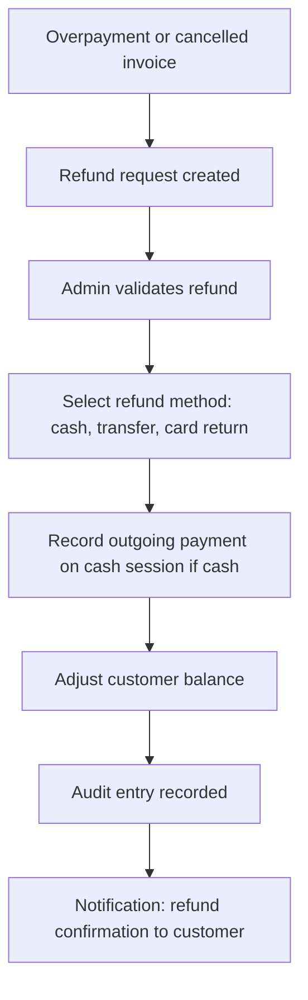

# Workflow — Customer Refund

```mermaid
flowchart TD
    A[Overpayment or cancelled invoice] --> B[Refund request created]
    B --> C[Admin validates refund]
    C --> D[Select refund method: cash, transfer, card return]
    D --> E[Record outgoing payment on cash session if cash]
    E --> F[Adjust customer balance]
    F --> G[Audit entry recorded]
    G --> H[Notification: refund confirmation to customer]
```
