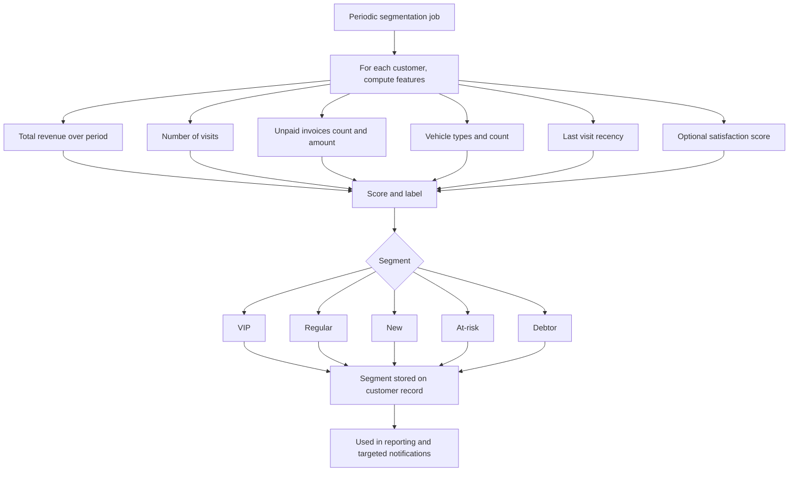

# Workflow — Customer Segmentation

```mermaid
flowchart TD
    A[Periodic segmentation job] --> B[For each customer, compute features]
    B --> C[Total revenue over period]
    B --> D[Number of visits]
    B --> E[Unpaid invoices count and amount]
    B --> F[Vehicle types and count]
    B --> G[Last visit recency]
    B --> H[Optional satisfaction score]
    C --> I[Score and label]
    D --> I
    E --> I
    F --> I
    G --> I
    H --> I
    I --> J{Segment}
    J --> K[VIP]
    J --> L[Regular]
    J --> M[New]
    J --> N[At-risk]
    J --> O[Debtor]
    K --> P[Segment stored on customer record]
    L --> P
    M --> P
    N --> P
    O --> P
    P --> Q[Used in reporting and targeted notifications]
```
