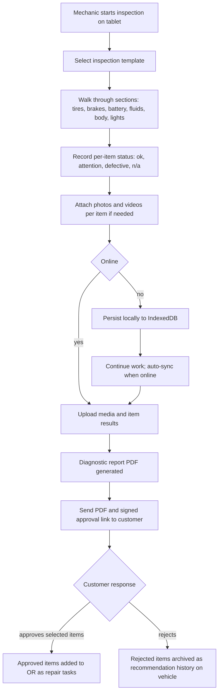

# Workflow — Digital Vehicle Inspection

```mermaid
flowchart TD
    A[Mechanic starts inspection on tablet] --> B[Select inspection template]
    B --> C[Walk through sections: tires, brakes, battery, fluids, body, lights]
    C --> D[Record per-item status: ok, attention, defective, n/a]
    D --> E[Attach photos and videos per item if needed]
    E --> F{Online}
    F -- no --> G[Persist locally to IndexedDB]
    G --> H[Continue work; auto-sync when online]
    F -- yes --> I[Upload media and item results]
    H --> I
    I --> J[Diagnostic report PDF generated]
    J --> K[Send PDF and signed approval link to customer]
    K --> L{Customer response}
    L -- approves selected items --> M[Approved items added to OR as repair tasks]
    L -- rejects --> N[Rejected items archived as recommendation history on vehicle]
```
