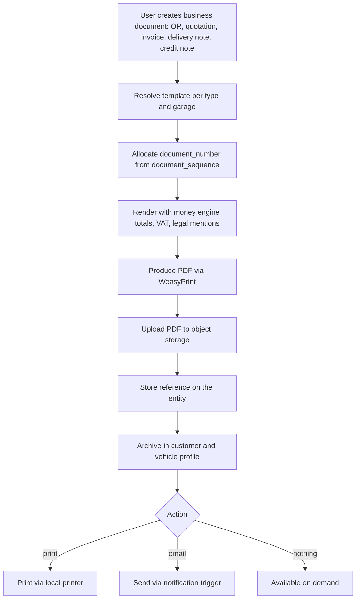

# Workflow — Document Generation

```mermaid
flowchart TD
    A[User creates business document: OR, quotation, invoice, delivery note, credit note] --> B[Resolve template per type and garage]
    B --> C[Allocate document_number from document_sequence]
    C --> D[Render with money engine totals, VAT, legal mentions]
    D --> E[Produce PDF via WeasyPrint]
    E --> F[Upload PDF to object storage]
    F --> G[Store reference on the entity]
    G --> H[Archive in customer and vehicle profile]
    H --> I{Action}
    I -- print --> J[Print via local printer]
    I -- email --> K[Send via notification trigger]
    I -- nothing --> L[Available on demand]
```
