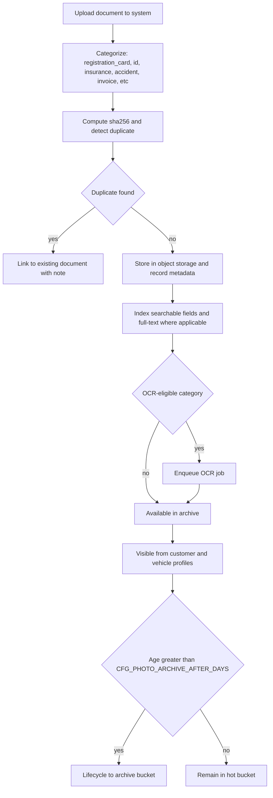

# Workflow — Document Management (GED)

```mermaid
flowchart TD
    A[Upload document to system] --> B[Categorize: registration_card, id, insurance, accident, invoice, etc]
    B --> C[Compute sha256 and detect duplicate]
    C --> D{Duplicate found}
    D -- yes --> E[Link to existing document with note]
    D -- no --> F[Store in object storage and record metadata]
    F --> G[Index searchable fields and full-text where applicable]
    G --> H{OCR-eligible category}
    H -- yes --> I[Enqueue OCR job]
    H -- no --> J[Available in archive]
    I --> J
    J --> K[Visible from customer and vehicle profiles]
    K --> L{Age greater than CFG_PHOTO_ARCHIVE_AFTER_DAYS}
    L -- yes --> M[Lifecycle to archive bucket]
    L -- no --> N[Remain in hot bucket]
```
