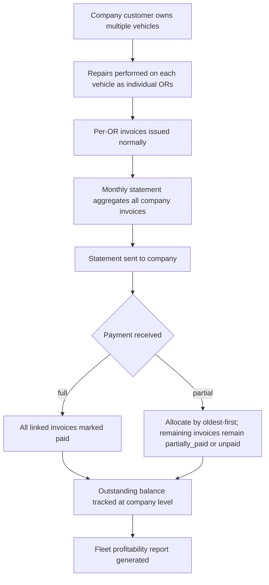

# Workflow — Fleet / Company Billing

```mermaid
flowchart TD
    A[Company customer owns multiple vehicles] --> B[Repairs performed on each vehicle as individual ORs]
    B --> C[Per-OR invoices issued normally]
    C --> D[Monthly statement aggregates all company invoices]
    D --> E[Statement sent to company]
    E --> F{Payment received}
    F -- full --> G[All linked invoices marked paid]
    F -- partial --> H[Allocate by oldest-first; remaining invoices remain partially_paid or unpaid]
    G --> I[Outstanding balance tracked at company level]
    H --> I
    I --> J[Fleet profitability report generated]
```
