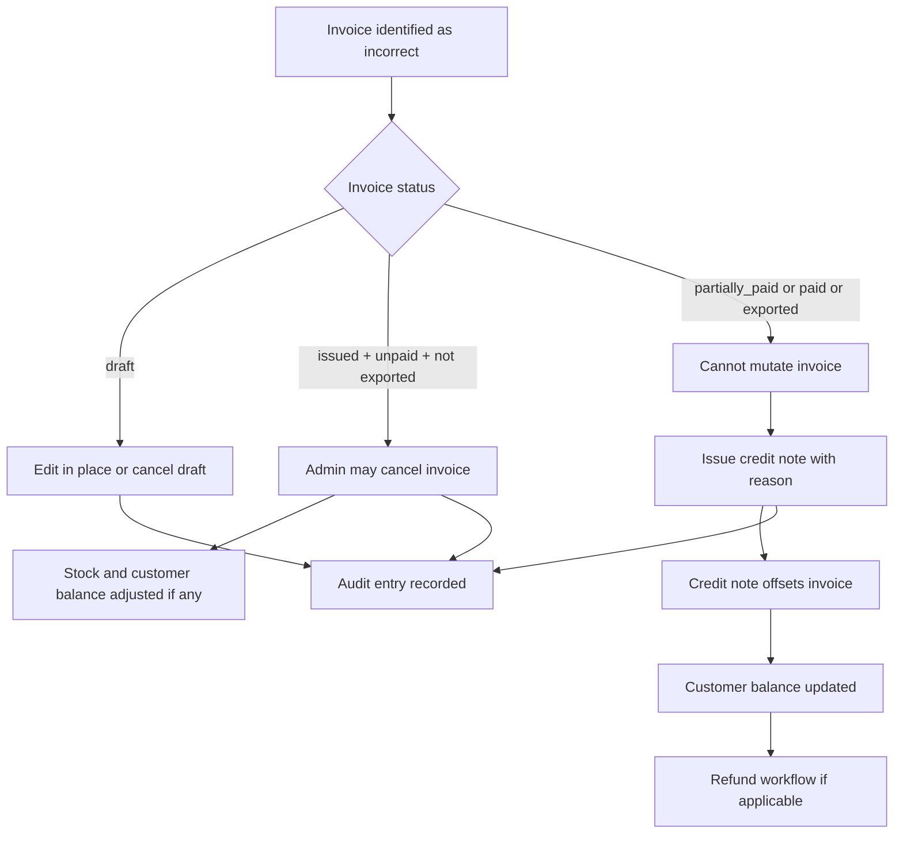

# Workflow — Invoice Cancellation / Credit Note

```mermaid
flowchart TD
    A[Invoice identified as incorrect] --> B{Invoice status}
    B -- draft --> C[Edit in place or cancel draft]
    B -- issued + unpaid + not exported --> D[Admin may cancel invoice]
    D --> E[Stock and customer balance adjusted if any]
    B -- partially_paid or paid or exported --> F[Cannot mutate invoice]
    F --> G[Issue credit note with reason]
    G --> H[Credit note offsets invoice]
    H --> I[Customer balance updated]
    I --> J[Refund workflow if applicable]
    C --> K[Audit entry recorded]
    D --> K
    G --> K
```
