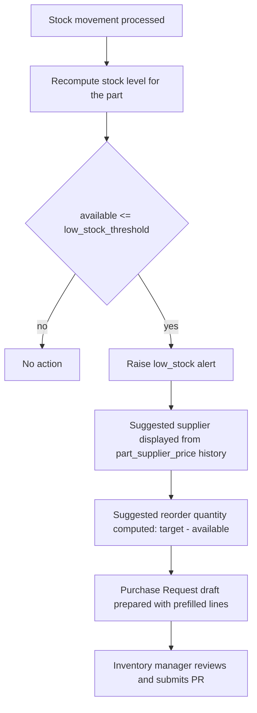

# Workflow — Low Stock Alert

```mermaid
flowchart TD
    A[Stock movement processed] --> B[Recompute stock level for the part]
    B --> C{available <= low_stock_threshold}
    C -- no --> D[No action]
    C -- yes --> E[Raise low_stock alert]
    E --> F[Suggested supplier displayed from part_supplier_price history]
    F --> G[Suggested reorder quantity computed: target - available]
    G --> H[Purchase Request draft prepared with prefilled lines]
    H --> I[Inventory manager reviews and submits PR]
```
