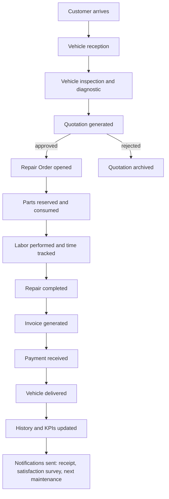

# Workflow — Main Business Flow

The end-to-end happy path of a garage visit.

```mermaid
flowchart TD
    A[Customer arrives] --> B[Vehicle reception]
    B --> C[Vehicle inspection and diagnostic]
    C --> D[Quotation generated]
    D -->|approved| E[Repair Order opened]
    D -->|rejected| Z[Quotation archived]
    E --> F[Parts reserved and consumed]
    F --> G[Labor performed and time tracked]
    G --> H[Repair completed]
    H --> I[Invoice generated]
    I --> J[Payment received]
    J --> K[Vehicle delivered]
    K --> L[History and KPIs updated]
    L --> M[Notifications sent: receipt, satisfaction survey, next maintenance]
```
