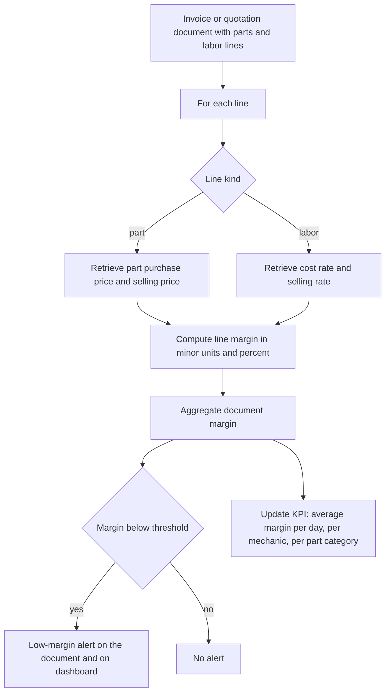

# Workflow — Margin Calculation

```mermaid
flowchart TD
    A[Invoice or quotation document with parts and labor lines] --> B[For each line]
    B --> C{Line kind}
    C -- part --> D[Retrieve part purchase price and selling price]
    C -- labor --> E[Retrieve cost rate and selling rate]
    D --> F[Compute line margin in minor units and percent]
    E --> F
    F --> G[Aggregate document margin]
    G --> H{Margin below threshold}
    H -- yes --> I[Low-margin alert on the document and on dashboard]
    H -- no --> J[No alert]
    G --> K[Update KPI: average margin per day, per mechanic, per part category]
```
