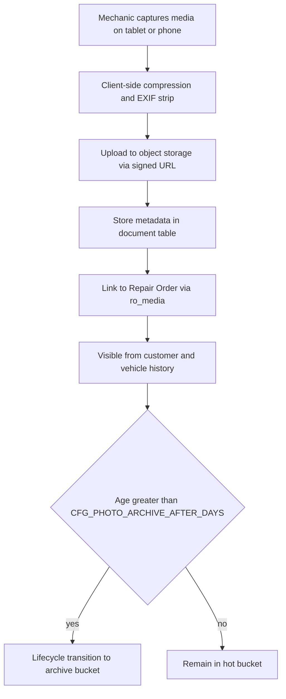

# Workflow — Photo and Media Management

```mermaid
flowchart TD
    A[Mechanic captures media on tablet or phone] --> B[Client-side compression and EXIF strip]
    B --> C[Upload to object storage via signed URL]
    C --> D[Store metadata in document table]
    D --> E[Link to Repair Order via ro_media]
    E --> F[Visible from customer and vehicle history]
    F --> G{Age greater than CFG_PHOTO_ARCHIVE_AFTER_DAYS}
    G -- yes --> H[Lifecycle transition to archive bucket]
    G -- no --> I[Remain in hot bucket]
```
