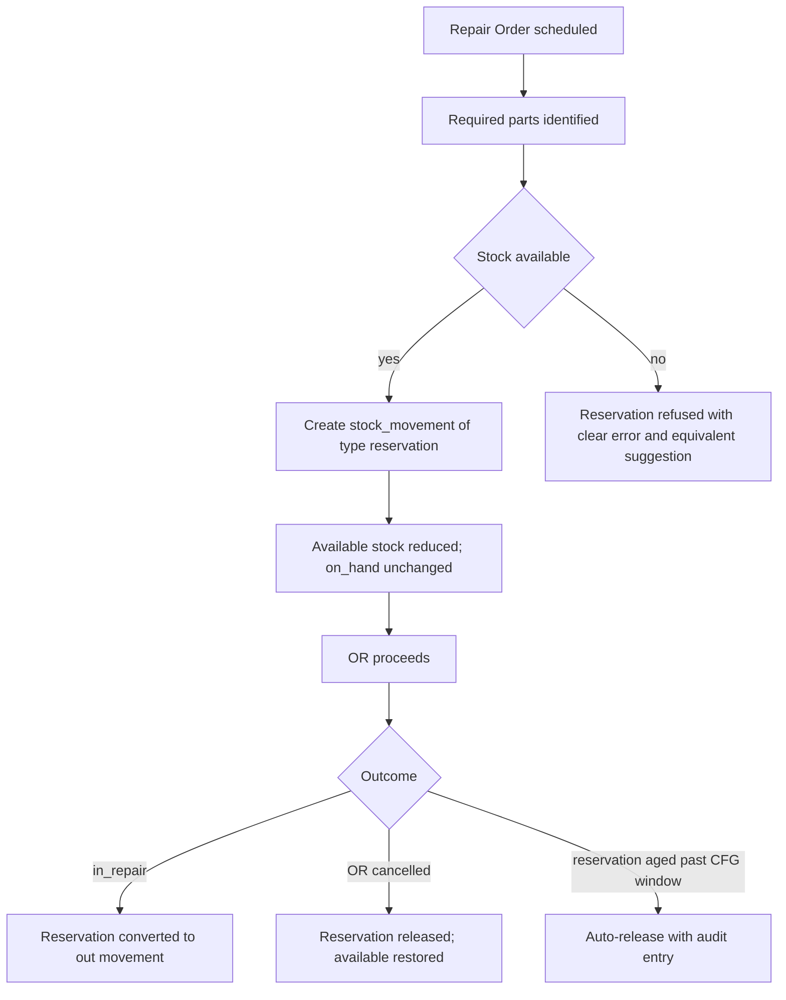

# Workflow — Part Reservation

```mermaid
flowchart TD
    A[Repair Order scheduled] --> B[Required parts identified]
    B --> C{Stock available}
    C -- yes --> D[Create stock_movement of type reservation]
    D --> E[Available stock reduced; on_hand unchanged]
    E --> F[OR proceeds]
    F --> G{Outcome}
    G -- in_repair --> H[Reservation converted to out movement]
    G -- OR cancelled --> I[Reservation released; available restored]
    G -- reservation aged past CFG window --> J[Auto-release with audit entry]
    C -- no --> K[Reservation refused with clear error and equivalent suggestion]
```
