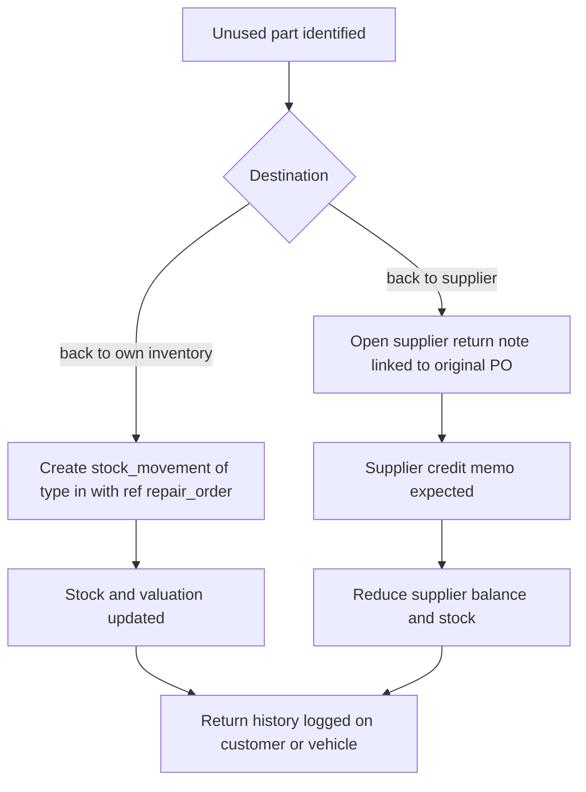

# Workflow — Part Returns

```mermaid
flowchart TD
    A[Unused part identified] --> B{Destination}
    B -- back to own inventory --> C[Create stock_movement of type in with ref repair_order]
    C --> D[Stock and valuation updated]
    B -- back to supplier --> E[Open supplier return note linked to original PO]
    E --> F[Supplier credit memo expected]
    F --> G[Reduce supplier balance and stock]
    D --> H[Return history logged on customer or vehicle]
    G --> H
```
