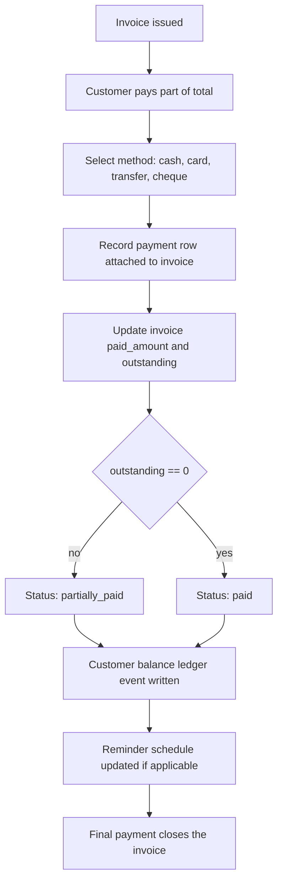

# Workflow — Partial Payment

```mermaid
flowchart TD
    A[Invoice issued] --> B[Customer pays part of total]
    B --> C[Select method: cash, card, transfer, cheque]
    C --> D[Record payment row attached to invoice]
    D --> E[Update invoice paid_amount and outstanding]
    E --> F{outstanding == 0}
    F -- yes --> G[Status: paid]
    F -- no --> H[Status: partially_paid]
    H --> I[Customer balance ledger event written]
    G --> I
    I --> J[Reminder schedule updated if applicable]
    J --> K[Final payment closes the invoice]
```
