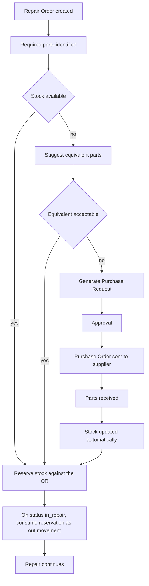

# Workflow — Parts and Inventory

```mermaid
flowchart TD
    A[Repair Order created] --> B[Required parts identified]
    B --> C{Stock available}
    C -- yes --> D[Reserve stock against the OR]
    D --> E[On status in_repair, consume reservation as out movement]
    C -- no --> F[Suggest equivalent parts]
    F --> G{Equivalent acceptable}
    G -- yes --> D
    G -- no --> H[Generate Purchase Request]
    H --> I[Approval]
    I --> J[Purchase Order sent to supplier]
    J --> K[Parts received]
    K --> L[Stock updated automatically]
    L --> D
    E --> M[Repair continues]
```
