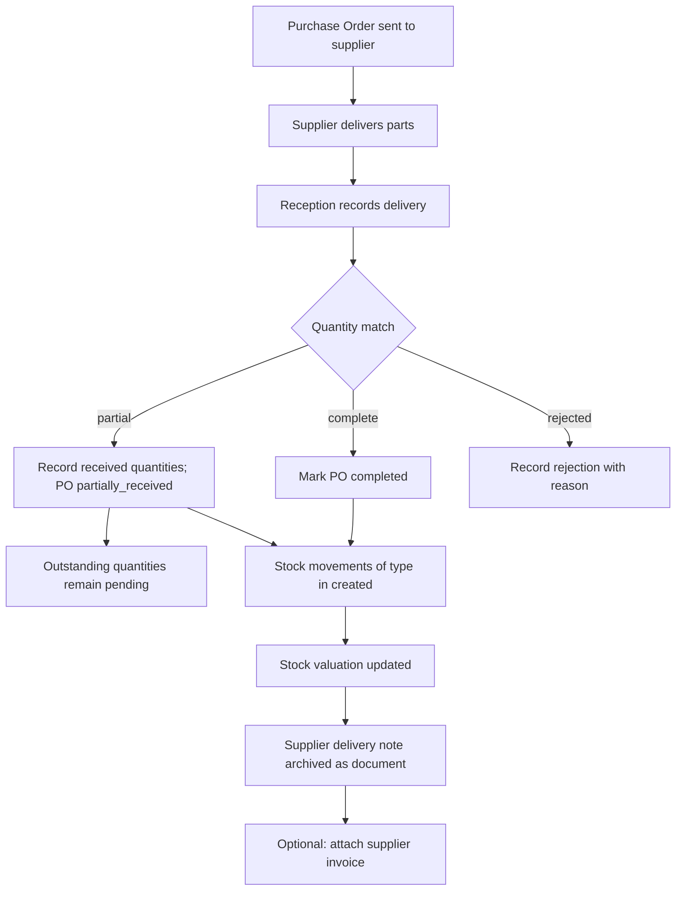

# Workflow — Purchase Order Reception

```mermaid
flowchart TD
    A[Purchase Order sent to supplier] --> B[Supplier delivers parts]
    B --> C[Reception records delivery]
    C --> D{Quantity match}
    D -- complete --> E[Mark PO completed]
    D -- partial --> F[Record received quantities; PO partially_received]
    F --> G[Outstanding quantities remain pending]
    D -- rejected --> H[Record rejection with reason]
    E --> I[Stock movements of type in created]
    F --> I
    I --> J[Stock valuation updated]
    J --> K[Supplier delivery note archived as document]
    K --> L[Optional: attach supplier invoice]
```
