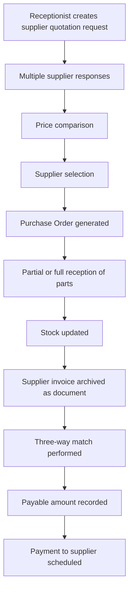

# Workflow — Purchase and Supplier Overview

```mermaid
flowchart TD
    A[Receptionist creates supplier quotation request] --> B[Multiple supplier responses]
    B --> C[Price comparison]
    C --> D[Supplier selection]
    D --> E[Purchase Order generated]
    E --> F[Partial or full reception of parts]
    F --> G[Stock updated]
    G --> H[Supplier invoice archived as document]
    H --> I[Three-way match performed]
    I --> J[Payable amount recorded]
    J --> K[Payment to supplier scheduled]
```
