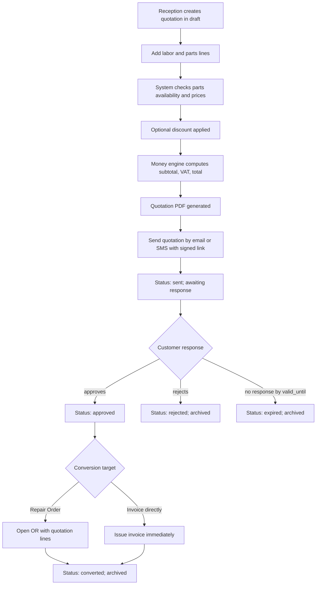

# Workflow — Quotation to Invoice

```mermaid
flowchart TD
    A[Reception creates quotation in draft] --> B[Add labor and parts lines]
    B --> C[System checks parts availability and prices]
    C --> D[Optional discount applied]
    D --> E[Money engine computes subtotal, VAT, total]
    E --> F[Quotation PDF generated]
    F --> G[Send quotation by email or SMS with signed link]
    G --> H[Status: sent; awaiting response]
    H --> I{Customer response}
    I -- approves --> J[Status: approved]
    I -- rejects --> K[Status: rejected; archived]
    I -- no response by valid_until --> L[Status: expired; archived]
    J --> M{Conversion target}
    M -- Repair Order --> N[Open OR with quotation lines]
    M -- Invoice directly --> O[Issue invoice immediately]
    N --> P[Status: converted; archived]
    O --> P
```
