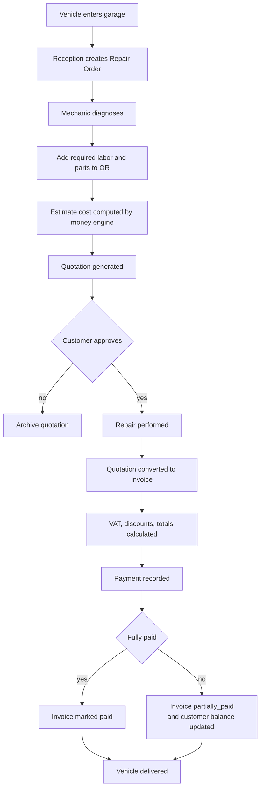

# Workflow — Standard Repair Invoicing

```mermaid
flowchart TD
    A[Vehicle enters garage] --> B[Reception creates Repair Order]
    B --> C[Mechanic diagnoses]
    C --> D[Add required labor and parts to OR]
    D --> E[Estimate cost computed by money engine]
    E --> F[Quotation generated]
    F --> G{Customer approves}
    G -- no --> H[Archive quotation]
    G -- yes --> I[Repair performed]
    I --> J[Quotation converted to invoice]
    J --> K[VAT, discounts, totals calculated]
    K --> L[Payment recorded]
    L --> M{Fully paid}
    M -- yes --> N[Invoice marked paid]
    M -- no --> O[Invoice partially_paid<br/>and customer balance updated]
    N --> P[Vehicle delivered]
    O --> P
```
