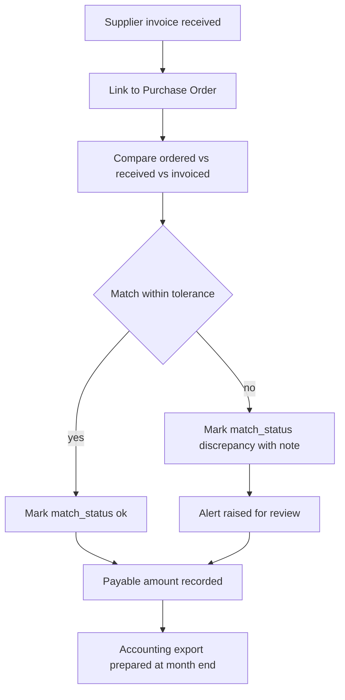

# Workflow — Supplier Invoice and Three-Way Match

```mermaid
flowchart TD
    A[Supplier invoice received] --> B[Link to Purchase Order]
    B --> C[Compare ordered vs received vs invoiced]
    C --> D{Match within tolerance}
    D -- yes --> E[Mark match_status ok]
    D -- no --> F[Mark match_status discrepancy with note]
    E --> G[Payable amount recorded]
    F --> H[Alert raised for review]
    H --> G
    G --> I[Accounting export prepared at month end]
```
