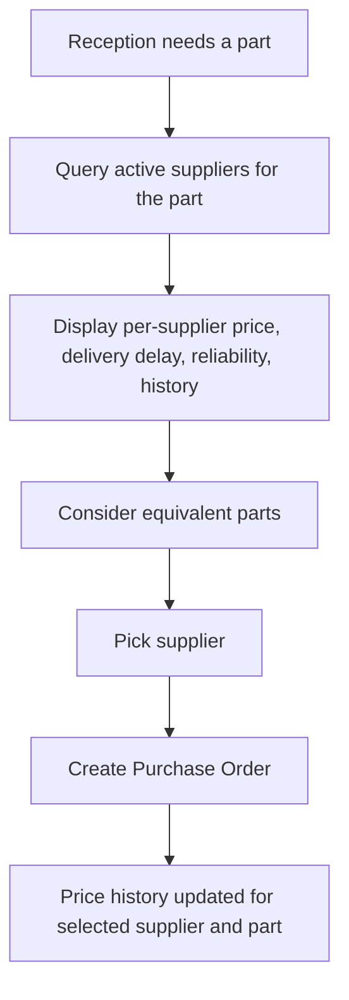

# Workflow — Supplier Price Comparison

```mermaid
flowchart TD
    A[Reception needs a part] --> B[Query active suppliers for the part]
    B --> C[Display per-supplier price, delivery delay, reliability, history]
    C --> D[Consider equivalent parts]
    D --> E[Pick supplier]
    E --> F[Create Purchase Order]
    F --> G[Price history updated for selected supplier and part]
```
