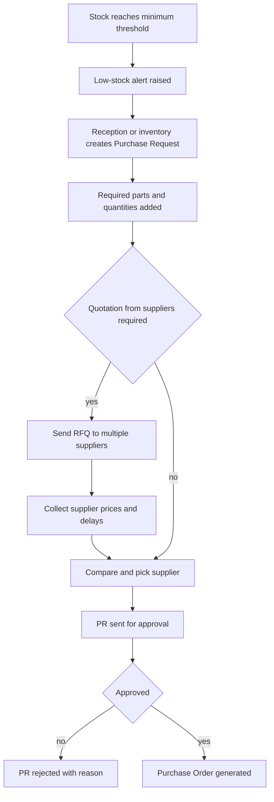

# Workflow — Supplier Purchase Request

```mermaid
flowchart TD
    A[Stock reaches minimum threshold] --> B[Low-stock alert raised]
    B --> C[Reception or inventory creates Purchase Request]
    C --> D[Required parts and quantities added]
    D --> E{Quotation from suppliers required}
    E -- yes --> F[Send RFQ to multiple suppliers]
    F --> G[Collect supplier prices and delays]
    G --> H[Compare and pick supplier]
    E -- no --> H
    H --> I[PR sent for approval]
    I --> J{Approved}
    J -- no --> Z[PR rejected with reason]
    J -- yes --> K[Purchase Order generated]
```
