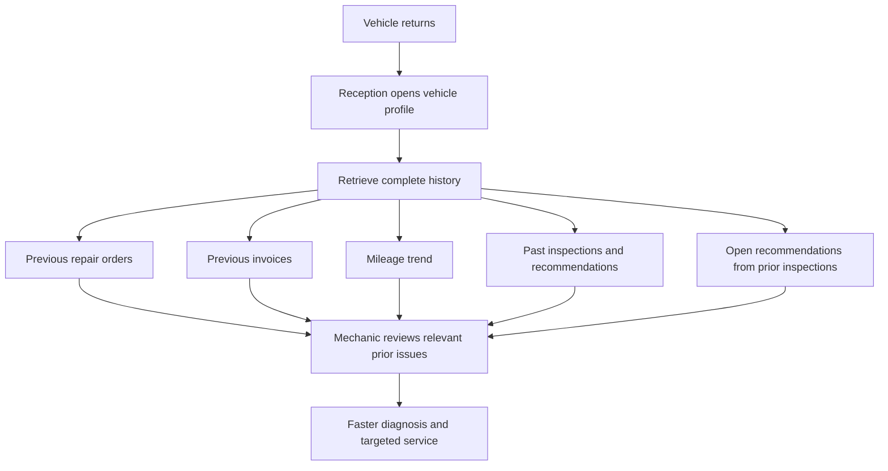

# Workflow — Vehicle History on Return Visit

```mermaid
flowchart TD
    A[Vehicle returns] --> B[Reception opens vehicle profile]
    B --> C[Retrieve complete history]
    C --> D[Previous repair orders]
    C --> E[Previous invoices]
    C --> F[Mileage trend]
    C --> G[Past inspections and recommendations]
    C --> H[Open recommendations from prior inspections]
    D --> I[Mechanic reviews relevant prior issues]
    E --> I
    F --> I
    G --> I
    H --> I
    I --> J[Faster diagnosis and targeted service]
```
