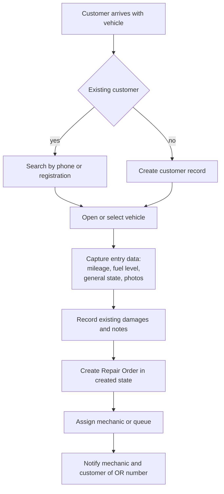

# Workflow — Vehicle Reception

```mermaid
flowchart TD
    A[Customer arrives with vehicle] --> B{Existing customer}
    B -- yes --> C[Search by phone or registration]
    B -- no --> D[Create customer record]
    C --> E[Open or select vehicle]
    D --> E
    E --> F[Capture entry data:<br/>mileage, fuel level,<br/>general state, photos]
    F --> G[Record existing damages and notes]
    G --> H[Create Repair Order in created state]
    H --> I[Assign mechanic or queue]
    I --> J[Notify mechanic and customer of OR number]
```
