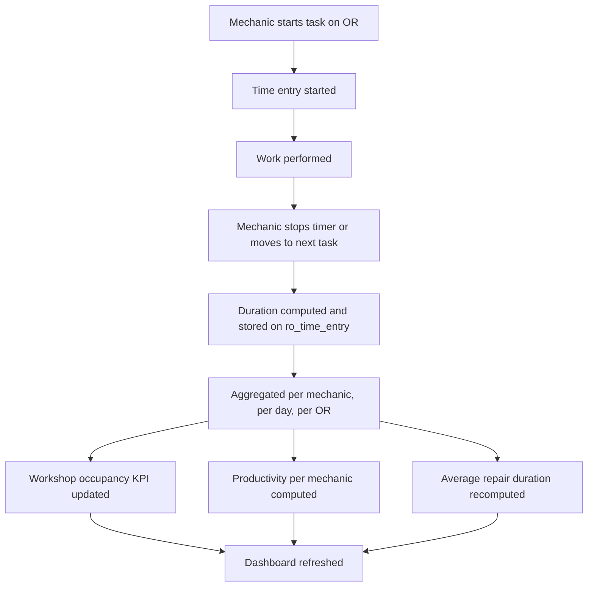

# Workflow — Workshop Performance Tracking

```mermaid
flowchart TD
    A[Mechanic starts task on OR] --> B[Time entry started]
    B --> C[Work performed]
    C --> D[Mechanic stops timer or moves to next task]
    D --> E[Duration computed and stored on ro_time_entry]
    E --> F[Aggregated per mechanic, per day, per OR]
    F --> G[Workshop occupancy KPI updated]
    F --> H[Productivity per mechanic computed]
    F --> I[Average repair duration recomputed]
    G --> J[Dashboard refreshed]
    H --> J
    I --> J
```
