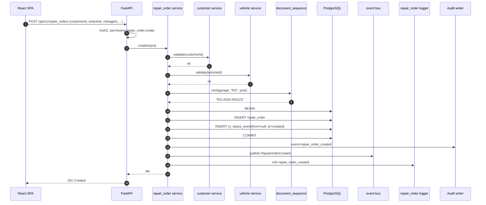

# Sequence — Create Repair Order

```mermaid
sequenceDiagram
    autonumber
    participant SPA as React SPA
    participant API as FastAPI
    participant RO as repair_order service
    participant CUST as customer service
    participant VEH as vehicle service
    participant DOC as document_sequence
    participant DB as PostgreSQL
    participant EVT as event bus
    participant LOG as repair_order logger
    participant AUD as Audit writer

    SPA->>API: POST /api/v1/repair_orders (customerId, vehicleId, mileageIn, ...)
    API->>API: AuthZ: permission repair_order.create
    API->>RO: create(input)
    RO->>CUST: validate(customerId)
    CUST-->>RO: ok
    RO->>VEH: validate(vehicleId)
    VEH-->>RO: ok
    RO->>DOC: next(garage, "RO", year)
    DOC-->>RO: "RO-2026-000123"
    RO->>DB: BEGIN
    RO->>DB: INSERT repair_order
    RO->>DB: INSERT ro_status_event(from=null, to=created)
    RO->>DB: COMMIT
    RO->>AUD: event=repair_order_created
    RO->>EVT: publish RepairOrderCreated
    RO->>LOG: info repair_order_created
    RO-->>API: dto
    API-->>SPA: 201 Created
```
